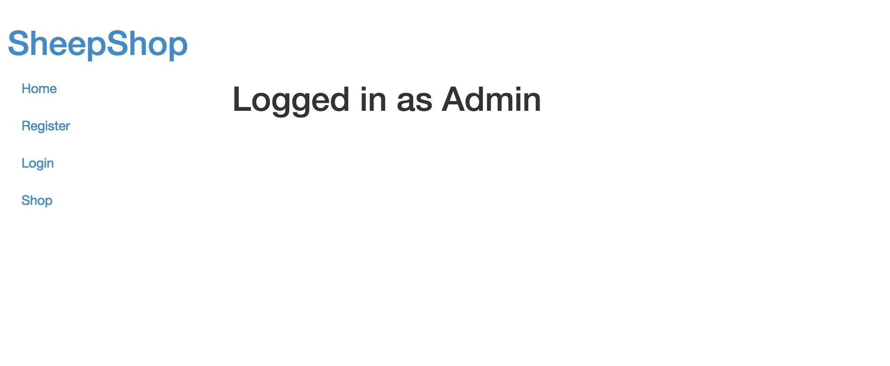
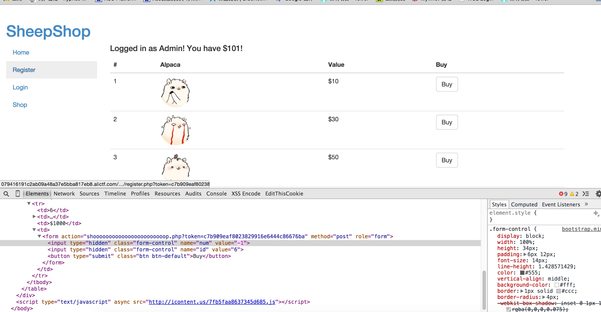

# alictf_write_up


#cake

这道题非常简单，使用了key与提交的字符进行了异或，判断之后的字符ascii与预设的数字相等，如果相等就通过，否则throw一个异常，check错误。比较坑的地方是下面的这段代码:

```java
        try {
            v0_1 = this.getKey();
        }
        catch(Exception v0) {
            v0_1 = this.getKey();
            System.arraycopy(v0_1, 0, arg10, v5, v5);
        }
```

仔细看try和catch的“K”是不一样的，try中调用的是父类中的方法，而非当前类的方法，所以key值应该是bobdylan。解码就简单了，直接用预设数字与key异或一下就可以得出正确的字符传了，解码代码如下：

```java
	public static void main(String[] args) {
		// TODO Auto-generated method stub
	       String v0_1 = "bobdylan";
	        int v7 = 15;
	        int v6 = 7;
	        int v1 = 0;
	        int v5 = 5;
        int[] v2 = new int[16];
        v2[0] = 0;
        v2[12] = 14;
        v2[10] = v6;
        v2[14] = v7;
        v2[v7] = 42;
        int v4 = 3;
        try {
            v2[1] = v4;
            v2[5] = 5;
            System.out.println();
        }
        catch(Exception v3) {
            v2[v5] = 37;
            v2[1] = 85;
        }

        v2[6] = v7;
        v2[2] = 13;
        v2[3] = 19;
        v2[11] = 68;
        v2[4] = 85;
        v2[13] = v5;
        v2[9] = v6;
        v2[v6] = 78;
        v2[8] = 22;
        while(v1 < 16) {
                System.out.print((char)((v2[v1] & 255)^(v0_1.charAt(v1 % v0_1.length()&255))));


            ++v1;
        }
	}

}
```

#前端初赛题1

利用svg标签里script能执行html hex的特性再urlencode，网站会把urldecode
>payload:
>http://089d9b2b0de6a319.alictf.com/xss.php?name=%3Csvg%3E%3Cscript%3E%26%23x61%3b%26%23x6c%3b%26%23x65%3b%26%23x72%3b%26%23x74%3b%26%23x28%3b%26%23x31%3b%26%23x29%3b%3C/script%3E


#简单业务逻辑

注册用户Admin+若干个空格(猜测后端使用了trim(username)然后insert到了数据库)
成功注册覆盖掉了Admin的密码  

发现钱不够啊，钱不够就得加啊，用负数买个东西就能加钱了

钱够了就能买flag了

